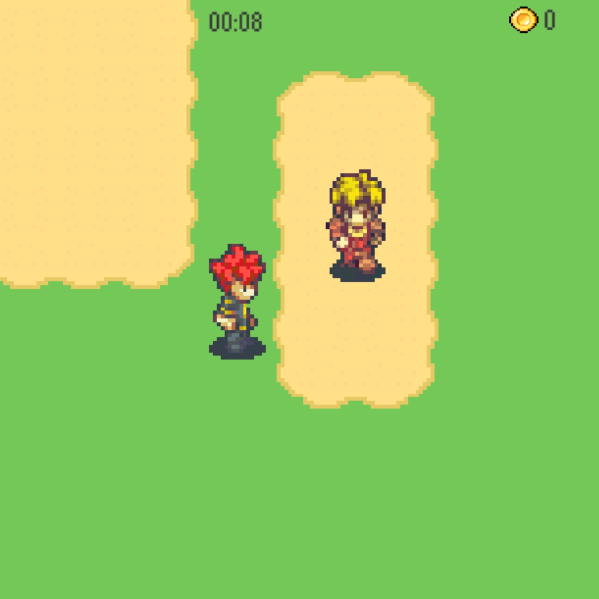

# ServiceNow (1#)

## Web Technlogies (2#)

### HTML (3#)

### CSS (3#)

### Javascript (3#)

#### Objects (4#)

##### Classes (5#)

*This is italic (1 asterics)*

_aslo italic (1 underscore)_

**This is bold (2 asterics)**

__This is also bold (2 underscore)__ 

> hello (1 >)
>> ohana means family (2 >)
>>> ok (3 >)

> ### Trauber Prompt
> Explain CSS
>
> Explain HTTP

* Cheese
* Milk
* Butter

- Fizz
- Buzz
- FizzBuzz

1. Water
   1. Highlander
2. Water
   1. Evian
3. Water
   1. Saka

 

